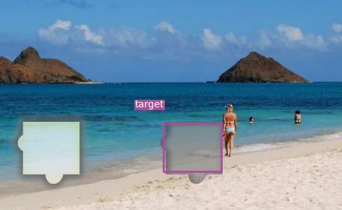

# 滑动验证码深度学习识别

本项目使用深度学习 YOLOV3 模型来识别滑动验证码缺口，基于 [https://github.com/eriklindernoren/PyTorch-YOLOv3](https://github.com/eriklindernoren/PyTorch-YOLOv3) 修改。

只需要几百张缺口标注图片即可训练出精度高的识别模型，识别效果样例：


## 克隆项目

运行命令：

```
git clone https://github.com/Python3WebSpider/DeepLearningSlideCaptcha.git
```

## 数据准备

使用 LabelImg 工具标注自行标注一批数据，大约 200 张以上即可训练出不错的效果。

LabelImg：[https://github.com/tzutalin/labelImg](https://github.com/tzutalin/labelImg)

标注要求：

* 圈出验证码目标滑块区域的完整完整矩形，无需标注源滑块。
* 目标矩形命名为 target 这个类别。
* 建议使用 LabelImg 的快捷键提高标注效率。

## 环境准备

建议在 GPU 环境和虚拟 Python 环境下执行如下命令：

```
pip3 install -r requirements.txt
```

## 预训练模型下载

YOLOV3 的训练要加载预训练模型才能有不错的训练效果，预训练模型下载：

```
bash prepare.sh
```

下载完成之后会在 weights 文件夹下出现模型权重文件，供训练使用。

## 训练

本项目已经提供了标注好的数据集，在 data/captcha，可以直接使用。

如果要训练自己的数据，数据格式准备见：[https://github.com/eriklindernoren/PyTorch-YOLOv3#train-on-custom-dataset](https://github.com/eriklindernoren/PyTorch-YOLOv3#train-on-custom-dataset)。

当前数据训练脚本：

```
bash train.sh
```

实测 P100 训练时长约 15 秒一个 epoch，大约几分钟即可训练出较好效果。

## 测试

训练完毕之后会在 checkpoints 文件夹生成 pth 文件，可直接使用模型来预测生成标注结果。

此时 checkpoints 文件夹会生成训练好的 pth 文件。

当前数据测试脚本：

```
sh detect.sh
```

该脚本会读取 captcha 下的 test 文件夹所有图片，并将处理后的结果输出到 test 文件夹。

运行结果样例：

```
Performing object detection:
        + Batch 0, Inference Time: 0:00:00.044223
        + Batch 1, Inference Time: 0:00:00.028566
        + Batch 2, Inference Time: 0:00:00.029764
        + Batch 3, Inference Time: 0:00:00.032430
        + Batch 4, Inference Time: 0:00:00.033373
        + Batch 5, Inference Time: 0:00:00.027861
        + Batch 6, Inference Time: 0:00:00.031444
        + Batch 7, Inference Time: 0:00:00.032110
        + Batch 8, Inference Time: 0:00:00.029131

Saving images:
(0) Image: 'data/captcha/test/captcha_4497.png'
        + Label: target, Conf: 0.99999
(1) Image: 'data/captcha/test/captcha_4498.png'
        + Label: target, Conf: 0.99999
(2) Image: 'data/captcha/test/captcha_4499.png'
        + Label: target, Conf: 0.99997
(3) Image: 'data/captcha/test/captcha_4500.png'
        + Label: target, Conf: 0.99999
(4) Image: 'data/captcha/test/captcha_4501.png'
        + Label: target, Conf: 0.99997
(5) Image: 'data/captcha/test/captcha_4502.png'
        + Label: target, Conf: 0.99999
(6) Image: 'data/captcha/test/captcha_4503.png'
        + Label: target, Conf: 0.99997
(7) Image: 'data/captcha/test/captcha_4504.png'
        + Label: target, Conf: 0.99998
(8) Image: 'data/captcha/test/captcha_4505.png'
        + Label: target, Conf: 0.99998
```

样例结果：




## 协议

本项目基于开源 [GNU 协议](https://github.com/eriklindernoren/PyTorch-YOLOv3/blob/master/LICENSE)
，另外本项目不提供任何有关滑动轨迹相关模拟和 JavaScript 逆向分析方案。

本项目仅供学习交流使用，请勿用于非法用途，本人不承担任何法律责任。

如有侵权请联系个人删除，谢谢。
